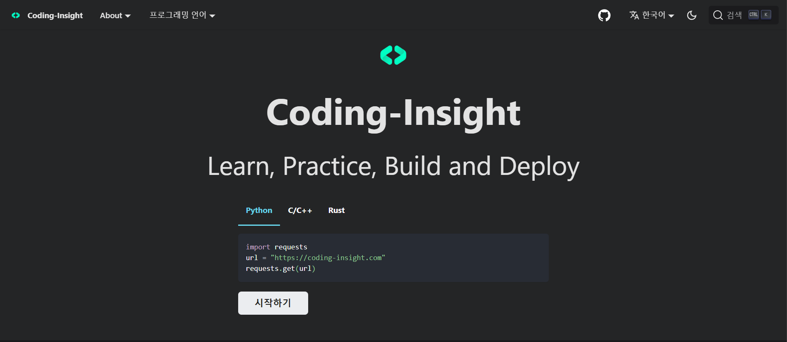

# Directory

This is the directory for website source cod for: https://www.coding-insight.com

# 🔧 Website configuration

The main config file for the website can be found at `website/docusaurus.config.js`. This file tells Docusaurus how to build the website. Edits to this file are rarely necessary.

The core subdirectory contains JavaScript and React components that are the core part of the website.

The `src/pages` subdirectory contains the React components that make up the non-documentation pages of the site, such as the homepage.

# Running locally

`cd website` to go into the website portion of the project.
`yarn start` to start the development server (powered by Docusaurus).
open http://localhost:3000/ to open the site in your favorite browser.

# 👏 Contributing

Create a branch

1. `git checkout main` from any folder in your local `coding-insight` repository.
2. `git pull origin main` to ensure you have the latest main code.
3. `git checkout -b the-name-of-my-branch` to create a branch.
   > replace `the-name-of-my-branch` with a suitable name, such as `update-animations-page`

# 📄 License

Coding-Insight is MIT licensed.
