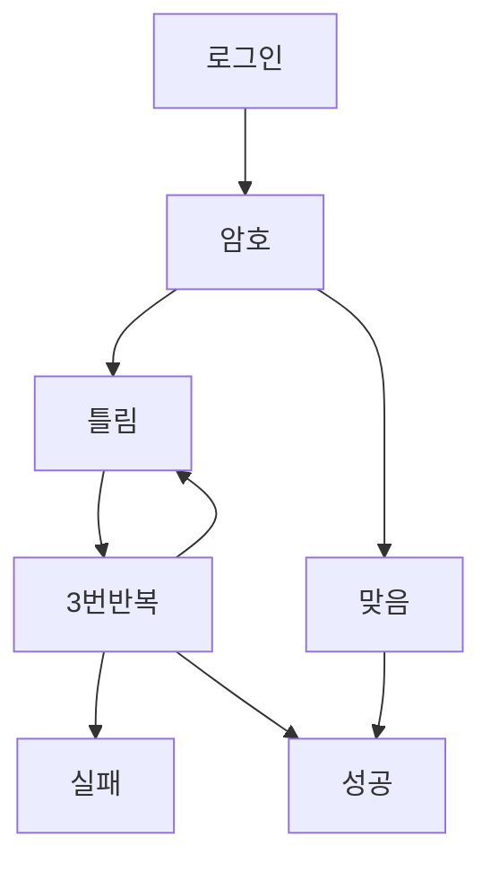

# 로그인 프로그램

파이썬을 사용해서 암호 로그인 프로그램을 만들어 보겠습니다!

먼저 시작하기 전에 조건문의 개념을 알아야 합니다.

추가할 기능: 만일 3번 이상 로그인 못하면 로그인 거절하기.

## 그래프



## 코드 설명

1. 코드는 암호 로그인 페이지에서 확인하세요. 추가로 몇 줄만 더 더할 것입니다.

2. 몇 번 시도했는지 저장하기

```py
guess_try = 0
```

3. 암호가 아니면 `guess_try`에 1 증가

```py
guess_try += 1
```

4. guess_try가 3번 이상이면 로그인 거절

:::note
참고로 while이라는 것은 밑 코드에서 `guess`가 `passsword` 아닐때만 그 안의 코드를 계속 실행합니다.
더 자세한 내용은 while 반복문 페이지에서 확인하세요.
:::

<iframe
  loading="lazy"
  title="Python IDLE Trinket"
  src="https://trinket.io/embed/python3/5382bd569c"
  height="400"
/>
