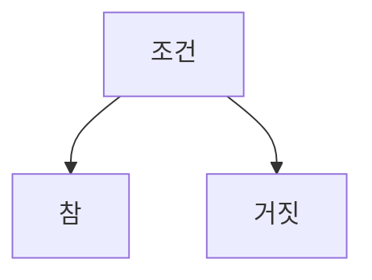

# 조건문

조건문이란 어떤 조건이 주어졌을 때 그 조건이 참이면 일부 코드를 실행하고 그렇지 않으면 실행하지 않는 형식을 뜻합니다.

예를 들면, 사용자의 이름이 'Biden'이라면 '미국 대통령'이라고 출력하는 코드는 다음과 같이 작성합니다.

```rust
fn main() {
  let name = "Biden";

  if name == "Biden" {
    println!("미국 대통령");
  }
}
```



<iframe
  loading="lazy"
  title="Rust Playground"
  src="https://play.rust-lang.org/?version=stable&mode=debug&edition=2021&code=fn%20main()%20%7B%0D%0A%20%20let%20name%20%3D%20%22Biden%22%3B%0D%0A%0D%0A%20%20if%20name%20%3D%3D%20%22Biden%22%20%7B%0D%0A%20%20%20%20println!(%22%EB%AF%B8%EA%B5%AD%20%EB%8C%80%ED%86%B5%EB%A0%B9%22)%3B%0D%0A%20%20%7D%0D%0A%7D"
  height="400"
/>

## if-else 형식

if-else는 if와 같지만 그 조건이 해당할 때 똑같이 일부 코드를 실행하지만 그 조건이 틀리다면 else 안에 그 코드를 넣을 수 있습니다.

즉, else라는 또 다른 코드를 추가한 조건문입니다.

```rust
fn main() {
  let name = "Biden";

  if name == "Biden" {
    println!("미국 대통령");
  } else {
    println!("아니요, 아니요, 미국 대통령이 아니요");
  }
}
```

<iframe
  loading="lazy"
  title="Rust Playground"
  src="https://play.rust-lang.org/?version=stable&mode=debug&edition=2021&code=%0D%0Afn%20main()%20%7B%0D%0A%20%20let%20name%20%3D%20%22Biden%22%3B%0D%0A%0D%0A%20%20if%20name%20%3D%3D%20%22Biden%22%20%7B%0D%0A%20%20%20%20println!(%22%EB%AF%B8%EA%B5%AD%20%EB%8C%80%ED%86%B5%EB%A0%B9%22)%3B%0D%0A%20%20%7D%20else%20%7B%0D%0A%20%20%20%20println!(%22%EC%95%84%EB%8B%88%EC%9A%94%2C%20%EC%95%84%EB%8B%88%EC%9A%94%2C%20%EB%AF%B8%EA%B5%AD%20%EB%8C%80%ED%86%B5%EB%A0%B9%EC%9D%B4%20%EC%95%84%EB%8B%88%EC%9A%94%22)%3B%0D%0A%20%20%7D%0D%0A%7D"
  height="400"
/>

## if-else if-else 형식

else if는 저번 조건이 틀리면서 이번에 다시 해당하는 조건이 성립한다면 실행할 코드를 넣을 수 있습니다.

즉, if의 조건이 틀리면 else if를 실행하고 else는 실행하지 않습니다.

하지만 if의 조건도 틀리고 else if의 조건도 틀리면 그 때 else를 실행합니다.

```rust
fn main() {
  let name = "Biden";

  if name == "Biden" {
    println!("미국 대통령");
  } else if name == "Trump" {
    println!("전 미국 대통령");
  } else {
    println!("아니요, 아니요, 미국 대통령이 아니요");
  }
}
```

<iframe
  loading="lazy"
  title="Rust Playground"
  src="https://play.rust-lang.org/?version=stable&mode=debug&edition=2021&code=fn%20main()%20%7B%0D%0A%20%20let%20name%20%3D%20%22Biden%22%3B%0D%0A%0D%0A%20%20if%20name%20%3D%3D%20%22Biden%22%20%7B%0D%0A%20%20%20%20println!(%22%EB%AF%B8%EA%B5%AD%20%EB%8C%80%ED%86%B5%EB%A0%B9%22)%3B%0D%0A%20%20%7D%20else%20if%20name%20%3D%3D%20%22Trump%22%20%7B%0D%0A%20%20%20%20println!(%22%EC%A0%84%20%EB%AF%B8%EA%B5%AD%20%EB%8C%80%ED%86%B5%EB%A0%B9%22)%3B%0D%0A%20%20%7D%20else%20%7B%0D%0A%20%20%20%20println!(%22%EC%95%84%EB%8B%88%EC%9A%94%2C%20%EC%95%84%EB%8B%88%EC%9A%94%2C%20%EB%AF%B8%EA%B5%AD%20%EB%8C%80%ED%86%B5%EB%A0%B9%EC%9D%B4%20%EC%95%84%EB%8B%88%EC%9A%94%22)%3B%0D%0A%20%20%7D%0D%0A%7D"
  height="400"
/>
